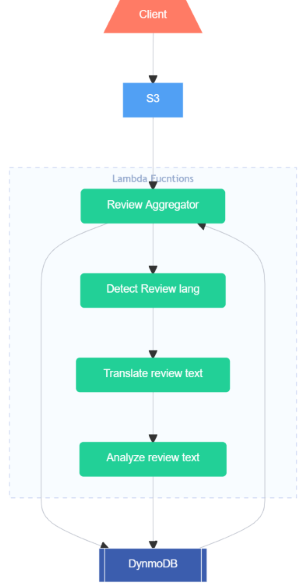

# DevOps Challenge
This repo provides a pipeline deployable on AWS that automates the Sentiment analysis and database inserting of movies reviews uploaded to an S3 bucket from a client application. The pipeline make use of DynamoDB, S3 and Lambda Function services from AWS. The Sentiment analysis is done in Batch Mode and by using Hugging Face package. 

The pipeline consists of of the following Lambda Function:

- review-aggregator
- detect-review-lang
- translate-review-text
- analyze-review-text

The Lambda fuctions are deployable to aws as docker images that are push into AWS ECR to know how follow this [link](https://docs.aws.amazon.com/lambda/latest/dg/gettingstarted-images.html).

## Prerequisites to deployment on AWS
- Creating an S3 bucket and make it the trigger to review-aggregator Lambda function.
- Creating Two DynamoDb tables for the preprocessed reviews (the buffer table) and postprocessed reviews.

## Pipeline Description

### [Review-Aggregator](reviews-aggregator/app.py)
This fucntion is used to buffer the reviews' text and metadata in the preprocessed reviews DynamoDB table until the threshold (bacth size) is collected and then invoke detect-review-lang function to start the rest of the pipeline to begin the processing.

### [Detect-review-lang](review-processing/detect-review-lang/app.py)
This Function is used to iterate over the reviews' original text and detect its language, update the JSON objects (accessed as a Dictionary in python) with the detected language and then send them to the invcoked isntance of translate-review-text function. The language detection is done using seqtolang package in this [link](https://github.com/hiredscorelabs/seqtolang)

### [Detect-review-lang](review-processing/translate-review-text/app.py)
This Function is used to iterate over the reviews and translate the non-english reviews text, update the JSON objects (accessed as a Dictionary in python) with with the traslated text and then send them to the invcoked isntance of analyze-review-text function. The transalation is done using both the Huggin Face transformers in this [link](https://github.com/huggingface/transformers) and the facebook multilingual model (m2m100_418M) 

### [Detect-review-lang](review-processing/analyze-review-text/app.py)
This Function is used to iterate over the reviews' text (orignal for english and translated for non-english) and perform sentiment analysis on each one, update the JSON objects (accessed as a Dictionary in python) with sentiment score and class and then store them in the dynamoDB postprocessed review table.

 
